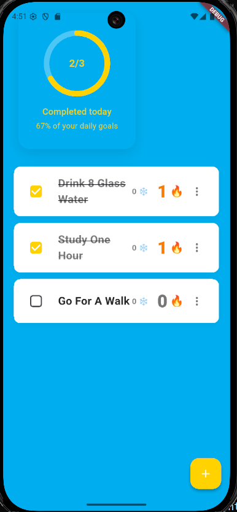

# 🎯 Habit Tracker

A modern Flutter habit tracking app with cloud sync, authentication, and intelligent streak management.

## 📱 App Preview



## ✨ Features

### 🔐 **User Authentication**
- Secure signup/login with email and password
- User-specific habit storage with cloud sync
- Beautiful auth screens with consistent design

### 📊 **Smart Habit Management**
- Add, complete, and delete habits with real-time sync
- Intelligent streak tracking with consecutive day monitoring
- Visual progress dashboard with circular indicators
- Optimistic UI updates for instant feedback

### ❄️ **Streak Freeze System** (Unique Feature)
- Earn 1 freeze every 3 consecutive days (max 3 total)
- Use freezes to protect streaks when you miss a day
- Visual indicators show available freezes and recent usage
- Strategic gameplay element to maintain motivation

### 🚀 **Advanced Features**
- **Cloud Sync** - Access your habits from any device
- **Offline Resilience** - UI responds instantly, syncs when online
- **Quick Actions** - Long press habits for freeze usage and deletion
- **Error Handling** - User-friendly error messages and recovery
- **Responsive Design** - Works on phones, tablets, and desktop

## 🛠️ Tech Stack

- **Frontend**: Flutter/Dart with Material Design
- **Backend**: Supabase (PostgreSQL database)
- **Authentication**: Supabase Auth with Row Level Security
- **State Management**: Flutter StatefulWidget with optimistic updates
- **Environment**: flutter_dotenv for secure credential management

## 🚀 Quick Start

### Prerequisites
- Flutter SDK (3.8.1+)
- Supabase account
- Android Studio/VS Code

### 1. Clone & Install
```bash
git clone <your-repo-url>
cd habit
flutter pub get
```

### 2. Environment Setup
```bash
# Copy environment template
cp .env.example .env

# Edit .env with your Supabase credentials
SUPABASE_URL=your_supabase_project_url
SUPABASE_ANON_KEY=your_supabase_anon_key
```

### 3. Database Setup
Run this SQL in your Supabase SQL Editor:

```sql
-- Create profiles table
CREATE TABLE profiles (
  id UUID PRIMARY KEY REFERENCES auth.users(id) ON DELETE CASCADE,
  email TEXT UNIQUE NOT NULL,
  full_name TEXT,
  avatar_url TEXT,
  created_at TIMESTAMPTZ DEFAULT NOW(),
  updated_at TIMESTAMPTZ DEFAULT NOW()
);

-- Create habits table
CREATE TABLE habits (
  id UUID PRIMARY KEY DEFAULT gen_random_uuid(),
  user_id UUID NOT NULL REFERENCES auth.users(id) ON DELETE CASCADE,
  name TEXT NOT NULL,
  is_completed BOOLEAN DEFAULT FALSE,
  current_streak INTEGER DEFAULT 0,
  best_streak INTEGER DEFAULT 0,
  streak_freezes INTEGER DEFAULT 0,
  created_date TIMESTAMPTZ DEFAULT NOW(),
  last_completed_date TIMESTAMPTZ,
  last_streak_freeze_used TIMESTAMPTZ,
  updated_at TIMESTAMPTZ DEFAULT NOW()
);

-- Enable RLS
ALTER TABLE profiles ENABLE ROW LEVEL SECURITY;
ALTER TABLE habits ENABLE ROW LEVEL SECURITY;

-- Create RLS policies
CREATE POLICY "Users can manage own profiles" ON profiles
  USING (auth.uid() = id);

CREATE POLICY "Users can manage own habits" ON habits
  USING (auth.uid() = user_id);

-- Auto-create profiles
CREATE OR REPLACE FUNCTION handle_new_user()
RETURNS TRIGGER AS $$
BEGIN
  INSERT INTO profiles (id, email, full_name)
  VALUES (NEW.id, NEW.email, COALESCE(NEW.raw_user_meta_data->>'full_name', ''));
  RETURN NEW;
END;
$$ LANGUAGE plpgsql SECURITY DEFINER;

CREATE TRIGGER on_auth_user_created
  AFTER INSERT ON auth.users
  FOR EACH ROW EXECUTE FUNCTION handle_new_user();
```

### 4. Run the App
```bash
# Development
flutter run

# Release APK
flutter build apk --release
```

## 📁 Project Structure

```
lib/
├── main.dart                 # App entry point with Supabase init
├── models/
│   └── habit.dart           # Habit data model with JSON serialization
├── screens/
│   ├── auth_screen.dart     # Login/signup with AuthWrapper
│   └── habit_details_screen.dart
├── services/
│   └── supabase_service.dart # Database operations & auth
└── widgets/
    └── error_display.dart   # Consistent error handling UI
```

## 🎮 How to Use

### Getting Started
1. **Sign Up** - Create account with email/password
2. **Add Habits** - Tap the + button to create your first habit
3. **Track Progress** - Check off habits daily to build streaks

### Streak System
- **Building Streaks**: Complete habits daily for consecutive day counts
- **Earning Freezes**: Get 1 freeze every 3 consecutive days (max 3)
- **Using Freezes**: Long press a habit → "Use Streak Freeze" to protect when you miss a day
- **Visual Feedback**: 🔥 for streak count, ❄️ for available freezes

### Advanced Features
- **Long press habits** for quick actions (freeze usage, deletion)
- **Tap the ⋮ menu** for habit details and management
- **Progress circle** shows daily completion percentage
- **Logout** via the app bar menu

## 🔧 Configuration

### Supabase Setup
1. Create a new Supabase project
2. Run the database setup SQL (see above)
3. Get your URL and anon key from Project Settings
4. Add to `.env` file

### Authentication Settings
- **Disable email confirmations** for development (Auth → Settings)
- **Configure URL redirects** if using email verification

## 📱 Building for Production

### Android APK
```bash
flutter build apk --release
# Output: build/app/outputs/flutter-apk/app-release.apk
```

### iOS (macOS required)
```bash
flutter build ios --release
```

## 🤝 Contributing

1. Fork the repository
2. Create your feature branch (`git checkout -b feature/amazing-feature`)
3. Commit your changes (`git commit -m 'Add amazing feature'`)
4. Push to the branch (`git push origin feature/amazing-feature`)
5. Open a Pull Request

## 📄 License

This project is part of the Alfred personal agent system - version 1.0 focusing on habit management.

## 🔮 Future Roadmap

- [ ] Habit statistics and analytics
- [ ] Customizable habit categories
- [ ] Social features and challenges
- [ ] Push notifications for reminders
- [ ] Habit templates and suggestions
- [ ] Export/import functionality
- [ ] Integration with health apps

---

**Built with ❤️ using Flutter and Supabase**  